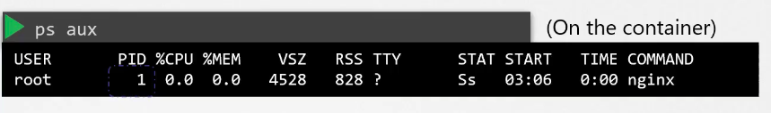
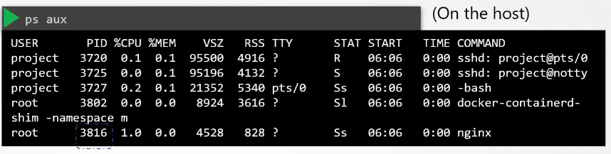
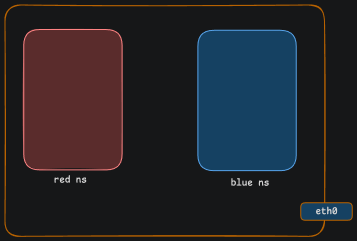
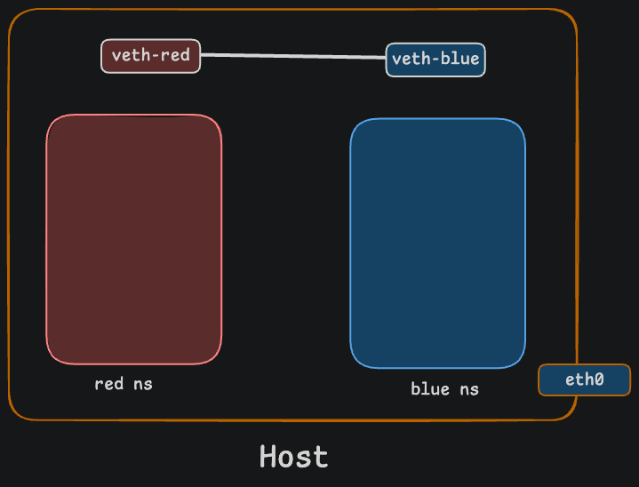
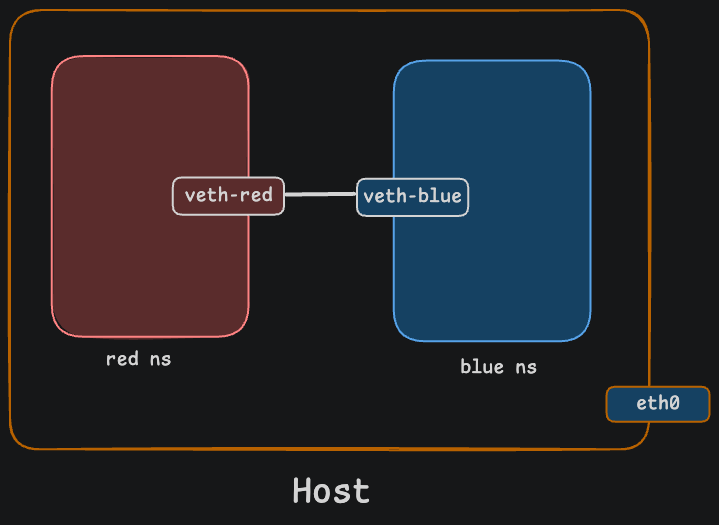
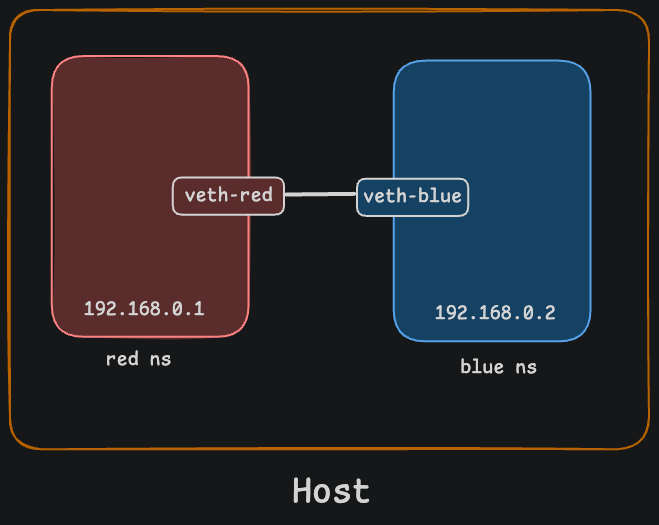

# Linux Network Namespaces: A Story 

## Introduction

A story-driven explanation of Linux Network Namespaces, their components, and how they enable containerization.


---

# The Story: The Linux Kingdom

Once upon a time, there was a big and modern palace called the **"Linux Kingdom."** The ruler of this kingdom was the **Host System**.

The Emperor had four children who were all growing up in the same palace. But there was a big problem: sharing the same space created total chaos. If one child built something, another would accidentally mess it up. If one played loud music, the other couldn't study in peace.

The Emperor thought:

> *"My children need freedom, but in a way that keeps them from interfering with each other."*

---

# 1. Four Kingdoms Within Four Walls (Namespaces)

The Emperor built four distinct rooms inside the palace. The walls around each room were so well-built that from inside, you couldn't see or hear anything happening outside.

Inside each room, the Emperor provided:

| Resource | Description |
|----------|-------------|
| **IP Address** | A separate water filter |
| **Routing Table** | A separate mailbox |
| **Port Numbers** | A separate phone line |

Now, the first child could sit in his room and talk on phone line `8080`, while at the exact same time, the second child used line `8080` in her room with no issues at all! Neither got a busy signal or port conflict.

Every child started to believe: *"This whole palace belongs only to me!"*

This invisible setup created by the Emperor is what Linux calls a **Network Namespace**.

---

# 2. The Invisible Shadow of the Emperor (The Root User)

Even though the children were independent and isolated inside their rooms, the Emperor was still the Emperor!

He held a magic **Master Key** (`sudo ip netns exec`). Standing anywhere in the palace, he could turn that key to enter any child's room instantly, check on what they were doing, or set up new rules.

However, the children couldn't leave their rooms on their own or enter their siblings' rooms.

```bash
# The Emperor's Master Key in action
sudo ip netns exec <namespace> <command>
```

---

# 3. Talking Through a Thread (The Veth Pair)

One day, the 1st and 2nd children wanted to share some secret messages. But how could they, with that wall between them? They asked the Emperor for help. As a father, you have visibility into all the rooms in the house as well as other areas of the house. If you wish, you can establish connectivity between two rooms in the house.

The Emperor brought a special magic silk thread with two secret intercom speakers attached to its ends (called a **veth pair**).

He placed one end in the 1st child's room (`veth0`) and the other end in the 2nd child's room (`veth1`). Now, they could safely send messages to each other without breaking down any walls!

---

# 4. The Palace Common Lounge and the Outside World (Bridge & NAT)

Later on, all four children wanted to join a competition together and connect with the outside world (the Internet).

So, the Emperor built a central switchboard or common lounge in the middle of the palace (a **Linux Bridge**). He plugged threads from all four rooms into this single switch.

At the main gate of the palace, he placed a guard. Whenever a letter came from a child inside, the guard stamped it with the palace's official seal before sending it outside. When replies came from the outside world, the guard delivered them to the correct child. In the Linux world, this smart guard is **NAT (iptables)**.

---

# Key Takeaways

| Story Element | Linux Concept | Description |
|---------------|---------------|-------------|
| The Rooms | **Network Namespaces** | Isolated network stacks (each with its own IP and ports) |
| The Emperor | **Host OS / Root User** | Controls everything |
| The Intercom Thread | **veth pair** | Direct connection between two namespaces |
| The Common Lounge | **Linux Bridge** | Connects all namespaces to the same network |
| The Gate Guard | **NAT / iptables** | Connects the internal network to the outside Internet |

---

# How This Applies to Real-World Technology

This story demonstrates how **Docker** and container technologies work in the background — keeping these little "princes" (containers) in separate rooms to manage the entire Linux system smoothly!

# Container Isolation

When you create a container, you want to make sure that it is isolated — that it does not see any other processes on the host or any other containers. We create a special room for it on our host using a namespace. As far as the container is concerned, it only sees the processes run by it and thinks that it is on its own host. The underlying host, however, has visibility into all of the processes, including those running inside the containers.



This can be seen when you list the processes within the container, you see a single process with the process ID of one. When you list the same processes as a root user from the underlying host, you see all the other processes along with the process running inside the container, this time with a different process ID. It's the same process running with different process IDs inside and outside the container. That's how namespaces work.



# Container Networking

When it comes to networking, our host has its own interfaces that connect to the local area network (LAN). Our host has its own routing and ARP tables with information about the rest of the network. We want to seal all of those details from the container when the container is created.


We create a network namespace for it that way it has no visibility to any network-related information on the host. Within its namespace, the container can have its own virtual interfaces, routing, and ARP tables. The container has its own interfaces.

To create a new network namespace on a Linux host:

```bash
# Create a network namespace
ip netns add <namespace-name>

# List all network namespaces
ip netns list

# Execute commands within a namespace
ip netns exec <namespace-name> <command>
``` 

## Hands-On: Building a Network Namespace from Scratch

Okay so now we are going to actually do this stuff on a Linux machine. No more stories. We will create two network namespaces called `blue` and `red`, connect them together, and make them talk to each other. Think of it like setting up two separate rooms and then running a wire between them so the people inside can talk.

---

### Step 1: Create the Network Namespaces

First thing we gotta do is create the namespaces themselves. A namespace is basically an imaginary box around the network. Anything inside that box can only see its own stuff. It cant see what's happening on the host or in any other namespace.

This matters because without namespaces, every container on your machine would see all the other network interfaces, IPs, and traffic. That would be a mess and also a security problem. So namespaces fix that by giving each container its own little private network world.

When you would use this: anytime you spin up a Docker container, Kubernetes pod, or any kind of isolated environment. They all use network namespaces under the hood.

```bash
sudo ip netns add red
sudo ip netns add blue
```



**What this does:** This creates two brand new network namespaces called `red` and `blue`. Right now they are completely empty. They each have a loopback interface but nothing else. They are like two empty rooms with no furniture.

**Why we need it:** We want two completely separate network environments. The `red` namespace should not know anything about the `blue` namespace and vice versa. Each one is going to act like its own independent machine.

You can check that they were created by listing them:

```bash
sudo ip netns list
```

You should see something like:

```
blue
red
```

---

### Step 2: Create a Virtual Ethernet Cable (veth pair)

Now we got two rooms but they are completely cut off from each other. We need to run a cable between them so they can talk. In Linux, this cable is called a **veth pair**. A veth pair always comes in twos. Whatever goes in one end comes out the other end. Kind of like a tube with two openings.

We need this because namespaces are isolated by default. There is no way for `red` to send anything to `blue` without some kind of connection. A veth pair gives us that connection without breaking the isolation walls.

When you would use this: whenever you want two namespaces or a namespace and the host to talk to each other. Docker uses veth pairs to connect containers to the host network.

```bash
sudo ip link add veth-red type veth peer name veth-blue
```



**What this does:** This creates a virtual ethernet cable with two ends. One end is called `veth-red` and the other end is called `veth-blue`. Both ends are sitting on the host right now. Nothing is plugged into any namespace yet. Think of it like you bought a cable but havent plugged it into anything.

**Why we need it:** Because we need a way for the two namespaces to communicate. The veth pair is that way. Data that goes into `veth-red` comes out of `veth-blue` and the other way around. Its a two way street.

You will see output like this:

```
6: veth-red@veth-blue: <BROADCAST,MULTICAST,M-DOWN> mtu 1500 qdisc noop state DOWN mode DEFAULT group default qlen 1000
    link/ether 22:21:fc:9e:d0:2b brd ff:ff:ff:ff:ff:ff
7: veth-blue@veth-red: <BROADCAST,MULTICAST,M-DOWN> mtu 1500 qdisc noop state DOWN mode DEFAULT group default qlen 1000
    link/ether 2e:34:8e:0c:1c:6e brd ff:ff:ff:ff:ff:ff
```

Notice it says `state DOWN` on both ends. That just means the cable is plugged in but nobody turned it on yet. Like a light switch that is still off.

---

### Step 3: Plug Each End Into Its Namespace

Alright so now we got the cable but both ends are still on the host. We need to take `veth-blue` and put it inside the `blue` namespace and take `veth-red` and put it inside the `red` namespace. This is like drilling a hole in each rooms wall and feeding the cable through.

This is important because a cable is useless if both ends are on the same side of the wall. We need one end in each room so the people on both sides can actually use it.

When you would use this: every single time you create a veth pair and want to connect a namespace to something. The veth ends have to be moved into the right namespaces for the connection to work.

```bash
sudo ip link set veth-blue netns blue
sudo ip link set veth-red netns red
```



**What this does:** This takes the `veth-blue` end of the cable and moves it into the `blue` namespace. Then it takes the `veth-red` end and moves it into the `red` namespace. After this, neither end is on the host anymore. They are each inside their own namespace.

**Why we need it:** Because we want `blue` to own one end and `red` to own the other end. That way when `blue` sends data into its end, it comes out on the `red` side. If both ends were still on the host, the namespaces would have no idea the cable even exists.

Now if you run `ip netns exec blue ip link show` you will see `veth-blue` sitting inside the blue namespace. Same thing for red. The cable is properly plugged in on both sides.

---

### Step 4: Assign IP Addresses

So the cable is plugged in on both sides but there are no addresses yet. Its like having a phone with no phone number. Nobody can call you because nobody knows your number. We need to give each end of the cable an IP address so they know where to send data.

This is needed because IP addresses are how devices find each other on a network. Without an IP, your interface literally cannot send or receive any traffic. The kernel wont know what to do with the data.

When you would use this: whenever you set up a veth pair between two namespaces. Both ends need IP addresses on the same subnet so they can actually talk.

```bash
sudo ip netns exec red ip addr add 192.168.0.1/24 dev veth-red
sudo ip netns exec blue ip addr add 192.168.0.2/24 dev veth-blue
```



**What this does:** This gives the `red` namespace the IP address `192.168.0.1` on its `veth-red` interface. And it gives the `blue` namespace the IP address `192.168.0.2` on its `veth-blue` interface. The `/24` means both of them are on the same subnet which is `192.168.0.0/24`.

**Why we need it:** Without IPs there is no networking. Period. The IP is what lets one end say hey I want to send data to the other end. The `/24` subnet tells both sides that they are on the same local network so they can reach each other directly without going through a router.

You can verify by running:

```bash
sudo ip netns exec blue ip addr show
sudo ip netns exec red ip addr show
```

You should see the IP addresses assigned like this:

```
7: veth-blue@if6: <BROADCAST,MULTICAST> mtu 1500 qdisc noop state DOWN group default qlen 1000
    link/ether 2e:34:8e:0c:1c:6e brd ff:ff:ff:ff:ff:ff link-netns red
    inet 192.168.0.2/24 scope global veth-blue
       valid_lft forever preferred_lft forever
```

and

```
6: veth-red@if7: <BROADCAST,MULTICAST> mtu 1500 qdisc noop state DOWN group default qlen 1000
    link/ether 22:21:fc:9e:d0:2b brd ff:ff:ff:ff:ff:ff link-netns blue
    inet 192.168.0.1/24 scope global veth-red
       valid_lft forever preferred_lft forever
```

---

### Step 5: Bring the Interfaces Up

We got the cable, its plugged in, and we gave it phone numbers. But the interfaces are still turned off. Its like having a phone that is powered off. Even though everything is set up, nothing is gonna work until you hit the power button.

This is a step that people forget all the time and then wonder why their ping is not working. By default every new interface starts in the DOWN state. You have to manually bring it up.

When you would use this: every single time you create a new interface or move a veth into a namespace. Interfaces start DOWN and you gotta turn them on.

```bash
sudo ip netns exec blue ip link set veth-blue up
sudo ip netns exec red ip link set veth-red up
```

**What this does:** This turns on the `veth-blue` interface inside the `blue` namespace and the `veth-red` interface inside the `red` namespace. Both ends of the cable are now powered on and ready to send and receive data.

**Why we need it:** Because nothing works when the interface is DOWN. No data goes in or out. The kernel basically ignores the interface completely when it is DOWN. Bringing it UP tells the kernel hey start paying attention to this interface and let data flow through it.

Check the status again:

```bash
sudo ip netns exec blue ip link show
sudo ip netns exec red ip link show
```

Notice now it says `state UP` instead of `state DOWN`:

```
7: veth-blue@if6: <BROADCAST,MULTICAST,UP,LOWER_UP> mtu 1500 qdisc noqueue state UP mode DEFAULT group default qlen 1000
    link/ether 2e:34:8e:0c:1c:6e brd ff:ff:ff:ff:ff:ff link-netns red
```

and

```
6: veth-red@if7: <BROADCAST,MULTICAST,UP,LOWER_UP> mtu 1500 qdisc noqueue state UP mode DEFAULT group default qlen 1000
    link/ether 22:21:fc:9e:d0:2b brd ff:ff:ff:ff:ff:ff link-netns blue
```

The `UP,LOWER_UP` means the interface is on and the link layer is also up. Everything is good to go on the physical level.

---

### Step 6: Set the Default Route

So now both sides can technically talk to each other if you ping the exact IP. But what happens when the `blue` namespace wants to talk to some random IP like `10.0.0.5`? It has no idea where to send that traffic because there is no default route set up.

A default route is basically a catch all rule that says hey if you dont know where to send this data just send it this way. We tell each namespace to use the other sides IP as its gateway so all traffic gets directed through the veth pair.

This is important because without a default route, your namespace can only talk to IPs that are directly on the same subnet. If you ever want your namespace to reach the outside world or even just another namespace through a bridge, you need routes.

When you would use this: when you want your namespace to be able to send traffic somewhere. Without a route the kernel has no idea where to forward the packet.

```bash
sudo ip netns exec red ip route add default via 192.168.0.1 dev veth-red
sudo ip netns exec blue ip route add default via 192.168.0.2 dev veth-blue
```

**What this does:** This sets the default route for the `red` namespace. It says anything that Red wants to send, send it through `192.168.0.1` on the `veth-red` interface. Same thing for Blue but through `192.168.0.2`.

**Why we need it:** Because routing is how the kernel decides where to send packets. If there is no route, the kernel just drops the packet with a "network unreachable" error. The default route gives the kernel a fallback path so it always knows where to send stuff.

You can check the routing tables:

```bash
sudo ip netns exec blue route
sudo ip netns exec red route
```

For red you should see:

```
Kernel IP routing table
Destination     Gateway         Genmask         Flags Metric Ref    Use Iface
default         192.168.0.1     0.0.0.0         UG    0      0        0 veth-red
192.168.0.0     0.0.0.0         255.255.255.0   U     0      0        0 veth-red
```

For blue you should see:

```
Kernel IP routing table
Destination     Gateway         Genmask         Flags Metric Ref    Use Iface
default         192.168.0.2     0.0.0.0         UG    0      0        0 veth-blue
192.168.0.0     0.0.0.0         255.255.255.0   U     0      0        0 veth-blue
```

---

### Step 7: Test Connectivity

Okay everything should be set up now. Lets actually test if the two namespaces can talk to each other. We use the good old `ping` command for this. Ping sends a small packet to the other side and waits for a reply. If the reply comes back, the connection works.

This is the moment of truth. If the ping works, that means our entire setup is correct. The namespaces are isolated, the veth pair is connected, the IPs are assigned, the interfaces are up, and the routing is working. If it does not work, something in the previous steps went wrong.

When you would use this: always after setting up any kind of network connection. Ping is the first thing you should try to verify that two machines or namespaces can reach each other.

```bash
sudo ip netns exec red ping 192.168.0.2
sudo ip netns exec blue ping 192.168.0.1
```

**What this does:** The first command goes into the `red` namespace and tries to ping the IP `192.168.0.2` which is the `blue` namespace. The second command does the opposite. It goes into the `blue` namespace and pings `192.168.0.1` which is the `red` namespace.

**Why we need it:** Because we need to verify that everything actually works. There is no point in setting all this up if you dont test it. Ping is the simplest and fastest way to check if two endpoints can talk to each other.

Expected output from red:

```
PING 192.168.0.2 (192.168.0.2) 56(84) bytes of data.
64 bytes from 192.168.0.2: icmp_seq=1 ttl=64 time=0.024 ms
64 bytes from 192.168.0.2: icmp_seq=2 ttl=64 time=0.069 ms
64 bytes from 192.168.0.2: icmp_seq=3 ttl=64 time=0.063 ms
64 bytes from 192.168.0.2: icmp_seq=4 ttl=64 time=0.064 ms
64 bytes from 192.168.0.2: icmp_seq=5 ttl=64 time=0.063 ms
^C
--- 192.168.0.2 ping statistics ---
5 packets transmitted, 5 received, 0% packet loss, time 4099ms
rtt min/avg/max/mdev = 0.024/0.056/0.069/0.016 ms
```

Expected output from blue:

```
PING 192.168.0.1 (192.168.0.1) 56(84) bytes of data.
64 bytes from 192.168.0.1: icmp_seq=1 ttl=64 time=0.033 ms
64 bytes from 192.168.0.1: icmp_seq=2 ttl=64 time=0.072 ms
64 bytes from 192.168.0.1: icmp_seq=3 ttl=64 time=0.071 ms
64 bytes from 192.168.0.1: icmp_seq=4 ttl=64 time=0.074 ms
64 bytes from 192.168.0.1: icmp_seq=5 ttl=64 time=0.070 ms
^C
--- 192.168.0.1 ping statistics ---
5 packets transmitted, 5 received, 0% packet loss, time 4099ms
rtt min/avg/max/mdev = 0.033/0.064/0.074/0.015 ms
```

If you see `5 packets transmitted, 5 received, 0% packet loss` that means everything is working perfectly. The two namespaces are talking to each other through the veth pair.

---

### Step 8: Check the ARP Cache

Now lets look at something called the ARP cache. ARP stands for Address Resolution Protocol. Basically it is how your machine maps an IP address to a physical MAC address. Every time you ping someone for the first time, your machine goes hey who has this IP and the other side responds with its MAC address. That mapping gets stored in the ARP cache so next time it does not have to ask again.

This is useful to know because if you are debugging network issues and the ping is not working, checking the ARP cache can tell you if the other side is even reachable. If the ARP entry says incomplete that means the machine tried to find the other side but never got a response.

When you would use this: when you are debugging network issues or just want to see what MAC address your namespace has learned about the other side.

```bash
sudo ip netns exec blue arp
sudo ip netns exec red arp
```

**What this does:** This shows the ARP table for each namespace. The ARP table is a list of IP to MAC address mappings that the namespace has learned.

**Why we need it:** Because it helps you understand what your namespace knows about the network. If you see an entry for the other sides IP with a MAC address, that means communication is working at the link layer.

ARP table for red:

```
Address                  HWtype  HWaddress           Flags Mask            Iface
192.168.0.2              ether   2e:34:8e:0c:1c:6e   C                     veth-red
```

ARP table for blue:

```
Address                  HWtype  HWaddress           Flags Mask            Iface
192.168.0.1              ether   22:21:fc:9e:d0:2b   C                     veth-blue
```

The `C` flag means the entry is complete and confirmed. Everything is working.

---

### Step 9: Clean Up

If you are done experimenting and want to remove everything you set up, this is how you clean it all. Deleting the namespaces will also automatically remove all the veth pairs and routes associated with them.

This is good practice because you dont want a bunch of leftover namespaces sitting around on your machine. They take up resources and can cause conflicts if you try to create new ones with the same names later.

When you would use this: whenever you are done testing and want to remove your setup. In a real production environment you would not do this manually because tools like Docker handle cleanup for you.

```bash
sudo ip netns del blue
sudo ip netns del red
```

**What this does:** This deletes the `blue` and `red` namespaces completely. All the interfaces, IPs, routes, and everything inside them gets wiped out.

**Why we need it:** Because you dont want stale namespaces lying around. Its like cleaning your room after you are done with a project. Keeps things tidy and avoids problems down the road.

---

## References

- [Linux Network Namespaces - Documentation](https://www.kernel.org/doc/Documentation/networking/netns.txt)
- [Docker Networking Deep Dive](https://docs.docker.com/engine/network/)
- [ip-netns man page](https://man7.org/linux/man-pages/man8/ip-netns.8.html)

---

**Author:** MD Anis

**Last Updated:** July 2026
