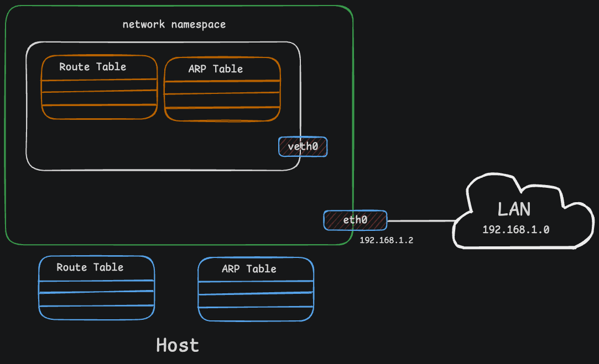

# Linux Network Namespaces

A hands-on lab series to understand how Linux network namespaces work, one step at a time.

---

## What Are Network Namespaces?

A network namespace is like a separate little world inside your Linux machine. Each namespace has its own IP addresses, routing tables, firewall rules, and network interfaces. The namespaces cannot see each other unless you specifically connect them. That is the whole point — isolation.

This is how Docker, Kubernetes, and basically every container technology works under the hood. When you run a container, it gets its own network namespace so it thinks it is the only thing running on the machine.

---

## The Story: The Linux Kingdom

Once upon a time, there was a big and modern palace called the **"Linux Kingdom."** The ruler of this kingdom was the **Host System**.

The Emperor had four children who were all growing up in the same palace. But there was a big problem: sharing the same space created total chaos. If one child built something, another would accidentally mess it up. If one played loud music, the other couldn't study in peace.

The Emperor thought:

> *"My children need freedom, but in a way that keeps them from interfering with each other."*

### The Rooms (Namespaces)

The Emperor built four distinct rooms inside the palace. The walls around each room were so well-built that from inside, you couldn't see or hear anything happening outside.

Inside each room, the Emperor provided:

| Resource | Description |
|----------|-------------|
| **IP Address** | A separate water filter |
| **Routing Table** | A separate mailbox |
| **Port Numbers** | A separate phone line |

Every child started to believe: *"This whole palace belongs only to me!"*

### The Master Key (Root User)

Even though the children were independent, the Emperor held a magic **Master Key** (`sudo ip netns exec`). He could enter any child's room instantly. But the children couldn't leave their rooms or enter their siblings' rooms.

### The Intercom Thread (veth pair)

The children wanted to share secret messages. The Emperor brought a magic silk thread with two intercom speakers — a **veth pair**. One end in each room. Now they could talk without breaking walls.

### The Common Lounge (Bridge & NAT)

Later, all children wanted to connect to the outside world. The Emperor built a central switchboard (**Linux Bridge**) and placed a guard at the gate (**NAT / iptables**) to manage traffic going in and out.

---

## Key Takeaways

| Story Element | Linux Concept | Description |
|---------------|---------------|-------------|
| The Rooms | **Network Namespaces** | Isolated network stacks (each with its own IP and ports) |
| The Emperor | **Host OS / Root User** | Controls everything |
| The Intercom Thread | **veth pair** | Direct connection between two namespaces |
| The Common Lounge | **Linux Bridge** | Connects all namespaces to the same network |
| The Gate Guard | **NAT / iptables** | Connects the internal network to the outside Internet |

---

## Real-World: How Containers Use This

When you create a container, you want it isolated — it should not see any other processes on the host or other containers. We create a network namespace for it so it has no visibility to any network-related information on the host.

From inside the container, it looks like you are on your own host. But from the host, you can see all the container processes.

The host has its own interfaces, routing tables, and ARP tables. The container gets its own separate set.

---

## Lab Series

| # | Lab | What You Will Learn |
|---|-----|---------------------|
| 01 | [Network Namespace Inspecting](01-network-namespace-inspecting/) | Create, list, exec into, and inspect namespaces |
| 02 | [Connect NS with veth](02-connect-network-ns-with-veth/) | Create a veth pair and plug it into two namespaces |
| 03 | [Assign IP Addresses](03-assign-ip-addresses/) | Give each namespace interface an IP address |
| 04 | [Bring Interfaces Up](04-bring-interfaces-up/) | Turn on interfaces so data can actually flow |
| 05 | [Routing Between NS](05-routing-between-ns/) | Set up default routes so namespaces know where to send traffic |
| 06 | [Test Connectivity](06-test-connectivity/) | Ping between namespaces, check ARP cache |
| 07 | [Bridge Network](07-bridge-network/) | Connect multiple namespaces using a Linux bridge |
| 08 | [FIB Network Topology](08-fib-network-topology/) | Understand the Forwarding Information Base and advanced routing |

---

**Author:** MD Anis 
**Last Updated:** July 2026
